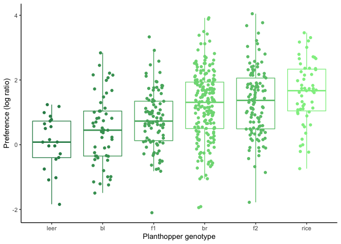
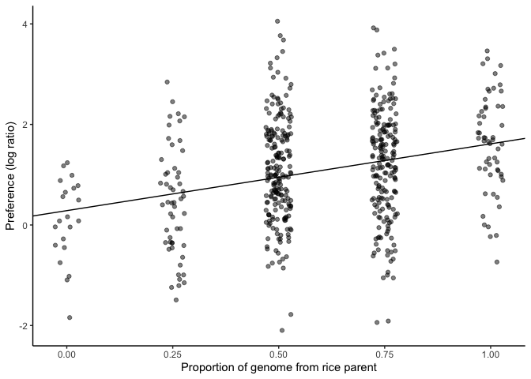
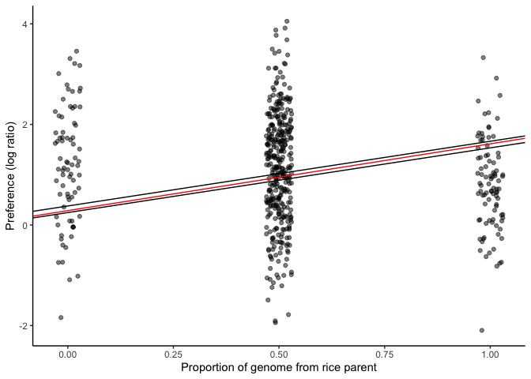
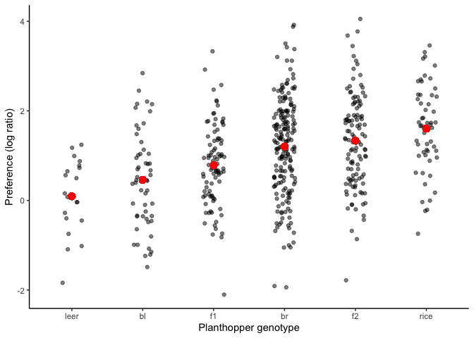
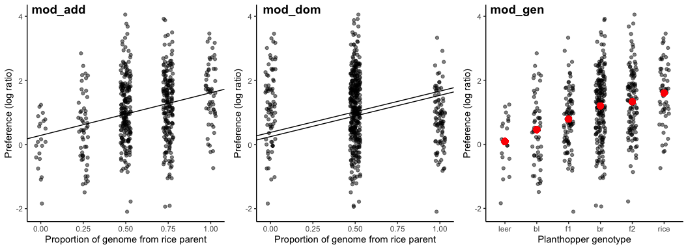

#Introduction


Welcome to the last assignment of 501! We'll be exploring models to describe patterns in planthopper oviposition preferences on different host plants. The explantory variable in this case is genotype of the planthopper. There are six genotypes with varying degrees of relatedness to either the hopper race which occurs on cultivated rice or that which occurs on _Leersia_, a wild aquatic plant. The response variable is "preference" which represents the log-transformed ratio of number of eggs laid on rice to the number laid on _Leersia_ when both plants were provided by the experimenters.


---

## Set-up
First let's call all the packages we'll need.

```r
suppressPackageStartupMessages(library(tidyverse))
suppressPackageStartupMessages(library(here))
suppressPackageStartupMessages(library(formattable))
suppressPackageStartupMessages(library(MuMIn))
suppressPackageStartupMessages(library(cowplot))
```

Now we can read in the data. An esteemed colleague pointed out in my last assignment that the here::here() function is unnecessary if I'm using an R project. It's true, I explained the overall reason for the existence of the package, but failed to provide its use in the context of my code. The way I'm using it allows for simplicity and readability when calling a file thats hidden away in a directory nested inside the working directory set by the .Rproj file. Hope that makes sense!

```r
hopper <- read_csv(here::here("Assignment_3", "hopper.csv"))
```

```
## Parsed with column specification:
## cols(
##   genotype = col_character(),
##   preference = col_double()
## )
```

---

##Visualizing the data
Let's take a look at the data with a graph. I'll explain each line of the code:

- First, using the mutate() function in concert with ifelse(), I assign a numerical scale to the genotypes to allow for later visualization of the degree of relatedness to the parent races. We'll eventually assign colors along a gradient to these values. Note: There may be a more elegant way to do this.

- Then using that new dataset, I start a ggplot. I assign genotype to the x-axis and reorder according to mean preference for rice. The y-axis is the preference ratio.

- I add a boxplot layer to get an idea of the spread of the data. I set the color to the scale I made in the first step, and I remove the outliers because those data points will be shown in the next step.

- I add a jitter layer to show each data point on top of the boxplots, setting the color in the same way as the boxplots. I also control the width of the jitter to make the graph more readable.

- I set the colors to a nice planthopper-y, rice-y green scale, add good axis labels, set the theme to remove the auto grey background of ggplot, and remove the automatic legend provided by setting the colors. 


```r
hopper %>% 
  mutate(col = ifelse(genotype=="leer", "5",
               ifelse(genotype=="bl", "4",
               ifelse(genotype=="f1", "3",
               ifelse(genotype=="br", "1",
               ifelse(genotype=="f2", "2", "0")))))) %>% 
  ggplot(aes(x = reorder(genotype, preference, FUN = median), y = preference)) +
    geom_boxplot(aes(color = as.numeric(col)), outlier.shape = NA) +
    geom_jitter(aes(color = as.numeric(col)), width = 0.2) +
    scale_color_gradient(low="palegreen2", high="seagreen4") +
    labs(x = "Planthopper genotype", y = "Preference (log ratio)") +
    theme_classic() +
    theme(legend.position = "none")
```

<!-- -->

The apparent pattern of the data show that preference for host is dependent on degree of relatedness to the parent races for either rice or _Leersia_. In other words, genotypes that are more closely related to the parent race that historically oviposits on rice will preferentially choose rice, and genotypes that are closley related to the race that oviposits on _Leersia_ will choose _Leersia_ when given a choice between the two plants.

I'll also make a table displaying the preference means and standard deviations for each genotype. Here's what my code is doing:

- First I group the data by genotype so that when I code for the means and std devs, it does it by genotype instead of for all the individuals in the whole dataset.
- I use transmute() to make a summary table of the means and std devs for each hopper genotype.
- I use distinct() to remove repeat rows.
- I arrange in increasing mean preference for better table readability.
- I round the decimal places to 2 for further readability.

```r
hopper %>% 
  group_by(genotype) %>% 
  transmute(mean_preference = mean(preference), sd_preference = sd(preference)) %>% 
  distinct() %>% 
  arrange(mean_preference) %>% 
  mutate_at(2:3, funs(round(., 2))) %>% 
  formattable()
```


<table class="table table-condensed">
 <thead>
  <tr>
   <th style="text-align:right;"> genotype </th>
   <th style="text-align:right;"> mean_preference </th>
   <th style="text-align:right;"> sd_preference </th>
  </tr>
 </thead>
<tbody>
  <tr>
   <td style="text-align:right;"> leer </td>
   <td style="text-align:right;"> 0.09 </td>
   <td style="text-align:right;"> 0.82 </td>
  </tr>
  <tr>
   <td style="text-align:right;"> bl </td>
   <td style="text-align:right;"> 0.46 </td>
   <td style="text-align:right;"> 1.07 </td>
  </tr>
  <tr>
   <td style="text-align:right;"> f1 </td>
   <td style="text-align:right;"> 0.79 </td>
   <td style="text-align:right;"> 0.91 </td>
  </tr>
  <tr>
   <td style="text-align:right;"> br </td>
   <td style="text-align:right;"> 1.20 </td>
   <td style="text-align:right;"> 1.08 </td>
  </tr>
  <tr>
   <td style="text-align:right;"> f2 </td>
   <td style="text-align:right;"> 1.33 </td>
   <td style="text-align:right;"> 1.05 </td>
  </tr>
  <tr>
   <td style="text-align:right;"> rice </td>
   <td style="text-align:right;"> 1.60 </td>
   <td style="text-align:right;"> 0.97 </td>
  </tr>
</tbody>
</table>

---

# First model

The next step in the instructions says:

> "Add a numeric variable in the data set to represent the proportion of the genome inherited from the rice parent"

Wow! I kind of already did this when I made the graph, but it wasn't saved in the dataset. Now I'll do it again following the instructions. I use the class() function to double-check my new variable is being read as a number and not a character.

```r
hopper <- hopper %>% 
  mutate(prop_rice = as.numeric(ifelse(genotype=="leer", "0",
                                ifelse(genotype=="bl", "0.25",
                                ifelse(genotype=="f1", "0.5",
                                ifelse(genotype=="f2", "0.5",
                                ifelse(genotype=="br", "0.75", "1")))))))

class(hopper$prop_rice)
```

```
## [1] "numeric"
```

This lm will model the situation where there is an additive effect between the two parent genotypes. The model will apply a linear increase of mean preference with proportion of genome inherited fromt the rice parent. The output will provide a slope and intercept for this line.


```r
mod_add <- lm(preference ~ prop_rice, data = hopper)

summary(mod_add)
```

```
## 
## Call:
## lm(formula = preference ~ prop_rice, data = hopper)
## 
## Residuals:
##     Min      1Q  Median      3Q     Max 
## -3.2230 -0.7199  0.0295  0.7195  3.0995 
## 
## Coefficients:
##             Estimate Std. Error t value Pr(>|t|)    
## (Intercept)   0.2855     0.1239   2.304   0.0216 *  
## prop_rice     1.3300     0.1927   6.904 1.47e-11 ***
## ---
## Signif. codes:  0 '***' 0.001 '**' 0.01 '*' 0.05 '.' 0.1 ' ' 1
## 
## Residual standard error: 1.041 on 522 degrees of freedom
## Multiple R-squared:  0.08367,	Adjusted R-squared:  0.08191 
## F-statistic: 47.66 on 1 and 522 DF,  p-value: 1.475e-11
```

Let's visualize the model with a trendline (coefficients taken from the summary output) through the data, and then evaluate its fit:


```r
plot_1 <- hopper %>% 
  ggplot(aes(x = prop_rice, y = preference)) +
    geom_jitter(alpha = 0.5, width = 0.03) +
    labs(x = "Proportion of genome from rice parent", y = "Preference (log ratio)") +
    theme_classic()

p1 <- plot_1 +
  geom_abline(slope = 1.3300, intercept = 0.2855)

p1
```

<!-- -->

The adjusted r-squared value is quite low (0.08191) meaning that only 8% of the variation in preference can be explained by the relatedness to the "rice" genotype, but there does appear to be a positive trend. I'm not sure this kind of model is best suited for the data because the values for prop_rice are not evenly distributed across the demonstrated range.

---

# Second model

For the next model, I'll include a variable that accounts for dominance effects in the hybrids. I'll make a new variable which gives each genotype a hybrid value: 0 for the parent races, 1 for the f1 hybrids, and 0.5 for everything in between.

```r
hopper <- hopper %>% 
  mutate(hybrid = as.numeric(ifelse(genotype=="leer", "0",
                             ifelse(genotype=="bl", "0.5",
                             ifelse(genotype=="f1", "1",
                             ifelse(genotype=="f2", "0.5",
                             ifelse(genotype=="br", "0.5", "0")))))))

class(hopper$hybrid)
```

```
## [1] "numeric"
```

Adding in the hybrid coefficient variable as a predictor will shift the intercept of the regression significantly if there are dominance effects in the system. Creating the model...

```r
mod_dom <- lm(preference ~ prop_rice + hybrid, data = hopper)

summary(mod_dom)
```

```
## 
## Call:
## lm(formula = preference ~ prop_rice + hybrid, data = hopper)
## 
## Residuals:
##     Min      1Q  Median      3Q     Max 
## -3.2186 -0.7120  0.0335  0.7114  3.0935 
## 
## Coefficients:
##             Estimate Std. Error t value Pr(>|t|)    
## (Intercept)   0.3780     0.1710   2.211   0.0275 *  
## prop_rice     1.2884     0.1999   6.446 2.61e-10 ***
## hybrid       -0.1315     0.1673  -0.786   0.4321    
## ---
## Signif. codes:  0 '***' 0.001 '**' 0.01 '*' 0.05 '.' 0.1 ' ' 1
## 
## Residual standard error: 1.041 on 521 degrees of freedom
## Multiple R-squared:  0.08475,	Adjusted R-squared:  0.08124 
## F-statistic: 24.12 on 2 and 521 DF,  p-value: 9.562e-11
```

We can visualize the new model fit with a graph. I will add in the regression from the first model in red so we can compare the two models.

```r
plot_2 <- hopper %>% 
    ggplot(aes(x = hybrid, y = preference)) +
    geom_jitter(alpha = 0.5, width = 0.03) +
    labs(x = "Proportion of genome from rice parent", y = "Preference (log ratio)") +
    theme_classic()

p2 <- plot_2 +
  geom_abline(slope = 1.2884, intercept = 0.3780) +
  geom_abline(slope = 1.2884, intercept = 0.3780 - 0.1315)

p2 +
  geom_abline(slope = 1.3300, intercept = 0.2855, color = "red")
```

<!-- -->

Visually, there does not appear to be a significant difference in model fit when we add in the hybrid variable. In fact, the adjusted r-squared value for this model is 0.08124, which is 0.00067 less than the first model. If there was a dominance effect, the regression line for this model would be shifted significantly toward the mean of whichever parent race had a dominant genotype, but there appears to be no such shift. 

---

# Third model

The third model is the simplest. Planthopper genotype will be the only predictor of host preference. This variable is categorical, so the model will only be predicting the group mean for each genotype. 

```r
mod_gen <- lm(preference ~ genotype, data = hopper)

summary(mod_gen)
```

```
## 
## Call:
## lm(formula = preference ~ genotype, data = hopper)
## 
## Residuals:
##      Min       1Q   Median       3Q      Max 
## -3.14267 -0.70382  0.03474  0.68014  2.71733 
## 
## Coefficients:
##              Estimate Std. Error t value Pr(>|t|)    
## (Intercept)    0.4598     0.1407   3.269  0.00115 ** 
## genotypebr     0.7429     0.1590   4.673 3.80e-06 ***
## genotypef1     0.3274     0.1769   1.851  0.06480 .  
## genotypef2     0.8735     0.1705   5.123 4.24e-07 ***
## genotypeleer  -0.3684     0.2640  -1.395  0.16356    
## genotyperice   1.1449     0.1971   5.809 1.10e-08 ***
## ---
## Signif. codes:  0 '***' 0.001 '**' 0.01 '*' 0.05 '.' 0.1 ' ' 1
## 
## Residual standard error: 1.024 on 518 degrees of freedom
## Multiple R-squared:  0.1199,	Adjusted R-squared:  0.1114 
## F-statistic: 14.11 on 5 and 518 DF,  p-value: 5.945e-13
```

The output gives us the group mean for genotype "bl" listed as "(Intercept)", and then the difference in group mean from that of bl for each of the other genotypes.

Let's visualize this output by putting a large red dot in the location of each group mean as predicted by the model: 

```r
p3 <- hopper %>%
  ggplot(aes(x = reorder(genotype, preference, FUN = mean), y = preference)) +
    geom_jitter(alpha = 0.5, width = 0.15) +
    geom_point(aes(x = "leer", y = 0.4598 - 0.3684), colour="red", size=3) +
    geom_point(aes(x = "bl", y = 0.4598), colour="red", size=3) +
    geom_point(aes(x = "f1", y = 0.4598 + 0.3274), colour="red", size=3) +
    geom_point(aes(x = "br", y = 0.4598 + 0.7429), colour="red", size=3) +
    geom_point(aes(x = "f2", y = 0.4598 + 0.8735), colour="red", size=3) +
    geom_point(aes(x = "rice", y = 0.4598 + 1.1449), colour="red", size=3) +
    labs(x = "Planthopper genotype", y = "Preference (log ratio)") +
    theme_classic()

p3
```

<!-- -->

This model doesn't attempt to fit an overall relationship for all the genotypes together like the previous two. Therefore, the model can more accurately predict the mean for each group separately. The adjusted r-squared for this model is 0.1114, which is 0.03 higher than the other two models. In this model, the predictor can account for 3% more variation in preference than the other two models. It seems to have the best fit according to r-squared values.

---

# Model Selection


```r
plot_grid(p1, p2, p3, nrow = 1, labels = c("mod_add", "mod_dom", "mod_gen"), label_x = 0.02)
```

<!-- -->

The third model, which predicted preference only by genotype, had a slightly higher adjusted r-quared value than the other two models. This may be indicative of better model fit, but we can further investigate this question using model selection methods such as AIC or BIC. Both methods balance the tradeoff between model fit and complexity, but BIC uses Bayesian statistics which requires a _a priori_ hypothesis for the relationship being tested. 

I will use AIC instead of BIC. BIC more heavily penalizes model complexity, but in this case, none of these three models are very complex. Additionally, BIC assumes that the "true" best model exists within the set that I have presented, meaning that the lowest BIC points to the highest likelihood of the true model. Instead, AIC does not make this assumption, so the lowest AIC points to the highest similarity to the true model. I am not confident that one of these three models is truely the best fit for the data out of all possible models, therefore I think AIC is more applicable.

I will simply call the AIC values for each model, and then use them to calculate Akaike weights. The results from these analyses will be displayed in a table below.

```r
AIC_add <- AIC(mod_add)
AIC_dom <- AIC(mod_dom)
AIC_gen <- AIC(mod_gen)
```

Calculating weights...

```r
AIC_all <- c(AIC_add, AIC_dom, AIC_gen)
delta <- AIC_all - min(AIC_all)
L <- exp(-0.5 * delta)
akaike_weights <- L/sum(L) 
```

Here are all the results!

| order | model | variables | adj. r^2 | AIC | Akaike weight |
| --- | --- | --- | --- | --- | --- |
| 1 | mod_add | preference ~ rice_prop | 0.08191 | 1532.99 | 0.001414 |
| 2 | mod_dom | preference ~ rice_prop + hybrid | 0.08124 | 1534.369 | 0.0007098 |
| 3 | mod_gen | preference ~ genotype | 0.1114 | 1519.872 | 0.9979 |

The third model has the highest r-squared, lowest AIC, and highest Akaike weight. We can conclude that the third model is the best of the three analyzed here. However, we don't know if the third model is _significantly_ better than the other two. To determine this unknown, I would like to break a rule given in the assignment instructions:

> "No P-values are allowed in your report" - Dolph Schluter

I'm going to conduct some ANOVAs to see how different the models are from each other. I'll create a table for better readability. Here's what my code is doing:

- First I save the results of the ANOVAs in tables called a1, a2, and a3, so that I can extract the p-values from them in my third column.
- Then I create the columns of my presentation table.
- Last, I build the presentation table out of the columns I just created.


```r
a1 <- anova(mod_gen, mod_add)
a2 <- anova(mod_gen, mod_dom)
a3 <- anova(mod_dom, mod_add)

mod_nums <- c("3, 1", "3, 2", "2, 1")
comparison <- c("mod_gen vs. mod_add", "mod_gen vs. mod_dom", "mod_dom vs. mod_add")
p_value <- c((a1[2,6]), (a2[2,6]), (a3[2,6]))

tibble(mod_nums, comparison, p_value) %>% 
  formattable()
```


<table class="table table-condensed">
 <thead>
  <tr>
   <th style="text-align:right;"> mod_nums </th>
   <th style="text-align:right;"> comparison </th>
   <th style="text-align:right;"> p_value </th>
  </tr>
 </thead>
<tbody>
  <tr>
   <td style="text-align:right;"> 3, 1 </td>
   <td style="text-align:right;"> mod_gen vs. mod_add </td>
   <td style="text-align:right;"> 0.0003290025 </td>
  </tr>
  <tr>
   <td style="text-align:right;"> 3, 2 </td>
   <td style="text-align:right;"> mod_gen vs. mod_dom </td>
   <td style="text-align:right;"> 0.0001483958 </td>
  </tr>
  <tr>
   <td style="text-align:right;"> 2, 1 </td>
   <td style="text-align:right;"> mod_dom vs. mod_add </td>
   <td style="text-align:right;"> 0.4321472039 </td>
  </tr>
</tbody>
</table>

According to the p-values from the ANOVAs, the first and second models are not significantly different from one another, but the third model is significantly different from both the first and the second models. This information combined with the AIC scores gives us a more comprehensive picture than either analysis on it's own. AIC tells us that mod_gen has the best fit, and the ANOVAs tells us this difference is _significant_.

---

#Conclusion

Often when we're fitting models, we have a hypothesized relationship in mind based on biological reasoning. Our goal is to find a model that best explains this relationship. One way to do this is to run a few models and perform ANOVAs on them to see if they differ significantly from a null hypothesis of no relationship (slope = 0). The problem with this method is that you then need a way to compare the models to each other. Using conventional null hypothesis to test these comparisons only provides information about if the models differ significantly from each other; it doesn't tell you which is the _best_. 

However, in this specific case, doing ANOVAs **and** looking at p-values would have given the same result as our AIC analysis. In my opinion, both AIC scores and p-values are valuable pieces of information and should be considered together when doing model selection.


